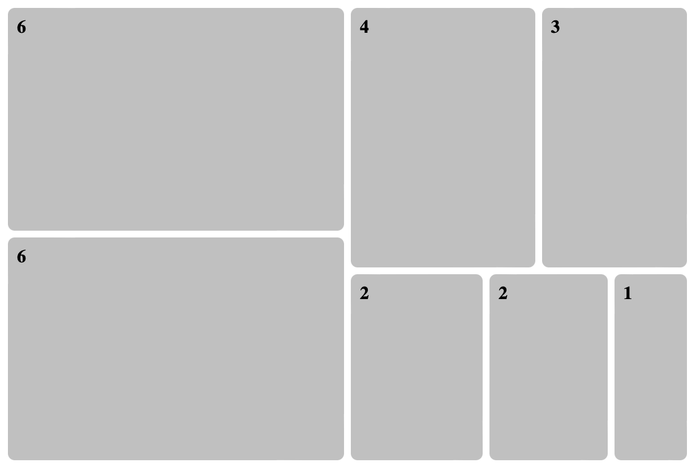
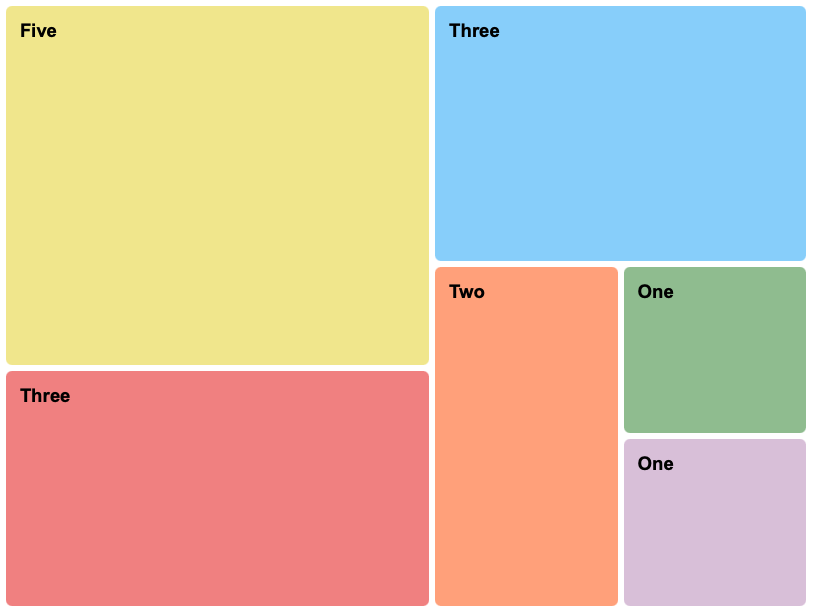
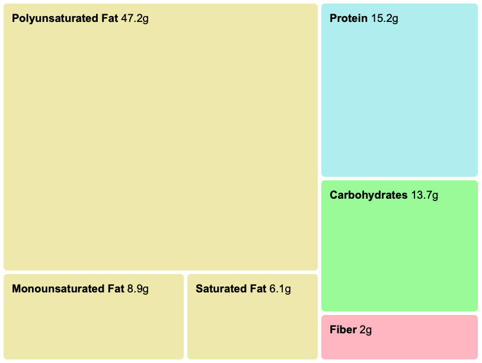

# vue-o-gram
A Treemap for vue. It's a vue component to chart data in a treemap layout. Use it most effectively for hierarchical or categorized data.

## Usage

### Basic Example



```html
<vue-o-gram 
	:items="[
		{ 'weight': 6 },
		{ 'weight': 6 },
		{ 'weight': 4 },
		{ 'weight': 3 },
		{ 'weight': 2 },
		{ 'weight': 2 },
		{ 'weight': 1 }
	]"
	v-slot="{ label }"
></vue-o-gram>
```

### Props

The `items` prop accepts an array of objects. Each object must include a `weight` property. Nested arrays are supported for hierarchical data.

| Attribute | Type   | Default | Required | Description                     |
|-----------|--------|---------|----------|---------------------------------|
| `weight`  | number | -       | Yes      | Determines the size of the item.|

### Slots

With a slot and additional properties the visualisation can be customised. Use the `content` slotProp to access the provided properties.

```html
<vue-o-gram
	:items="[
		{
			'label': 'Three',
			'weight': 3,
			'color': 'lightcoral'
		},
		{
			'label': 'Three',
			'weight': 3,
			'color': 'lightskyblue'
		},
		{
			'label': 'One',
			'weight': 1,
			'color': 'darkseagreen'
		},
		{
			'label': 'Five',
			'weight': 5,
			'color': 'khaki'
		},
		{
			'label': 'One',
			'weight': 1,
			'color': 'thistle'
		},
		{
			'label': 'Two',
			'weight': 2,
			'color': 'lightsalmon'
		}
	]"
	v-slot="{ content }">
	<div class="item">
		<span>
			<strong>{{ content.label }}</strong>
		</span>
	</div>
</vue-o-gram>
```



### Nested Treemap

Visualize grouped data by nesting arrays within the `items` prop.

```html
<vue-o-gram 
	:items="[
			{
				'label': 'Carbohydrates',
				'weight': 13.7,
				'color': 'palegreen'
			},
			[
				{
					'label': 'Saturated Fat',
					'weight': 6.1,
					'color': 'palegoldenrod'
				},
				{
					'label': 'Polyunsaturated Fat',
					'weight': 47.2,
					'color': 'palegoldenrod'
				},
				{
					'label': 'Monounsaturated Fat',
					'weight': 8.9,
					'color': 'palegoldenrod'
				}
			],
			{
				'label': 'Protein',
				'weight': 15.2,
				'color': 'paleturquoise'
			},
			{
				'label': 'Fiber',
				'weight': 2,
				'color': 'lightpink'
			}
	]"
	v-slot="{ content }">
		<div class="item" :style="{ backgroundColor:content.color }">
			<span>
				<strong>{{ content.label }}</strong>
				{{ content.weight }}
			</span>
		</div>
</vue-o-gram>
```



## Algorithm

The treemap is generated with the "squarified" algorithm.